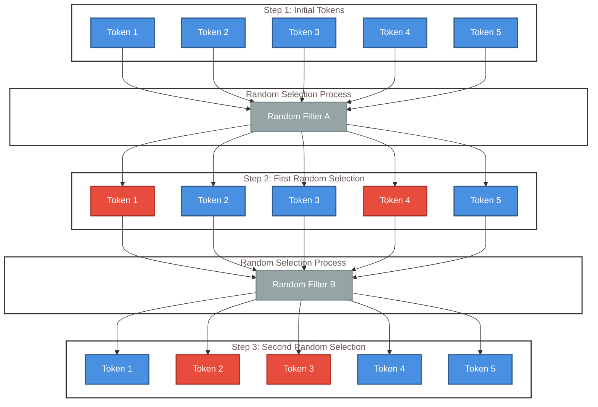
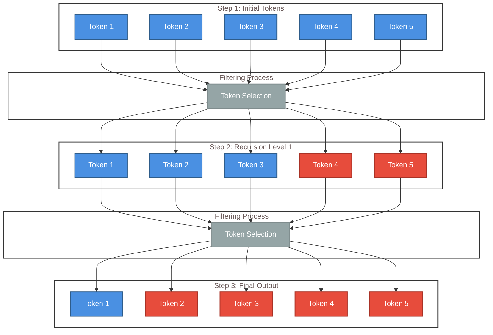
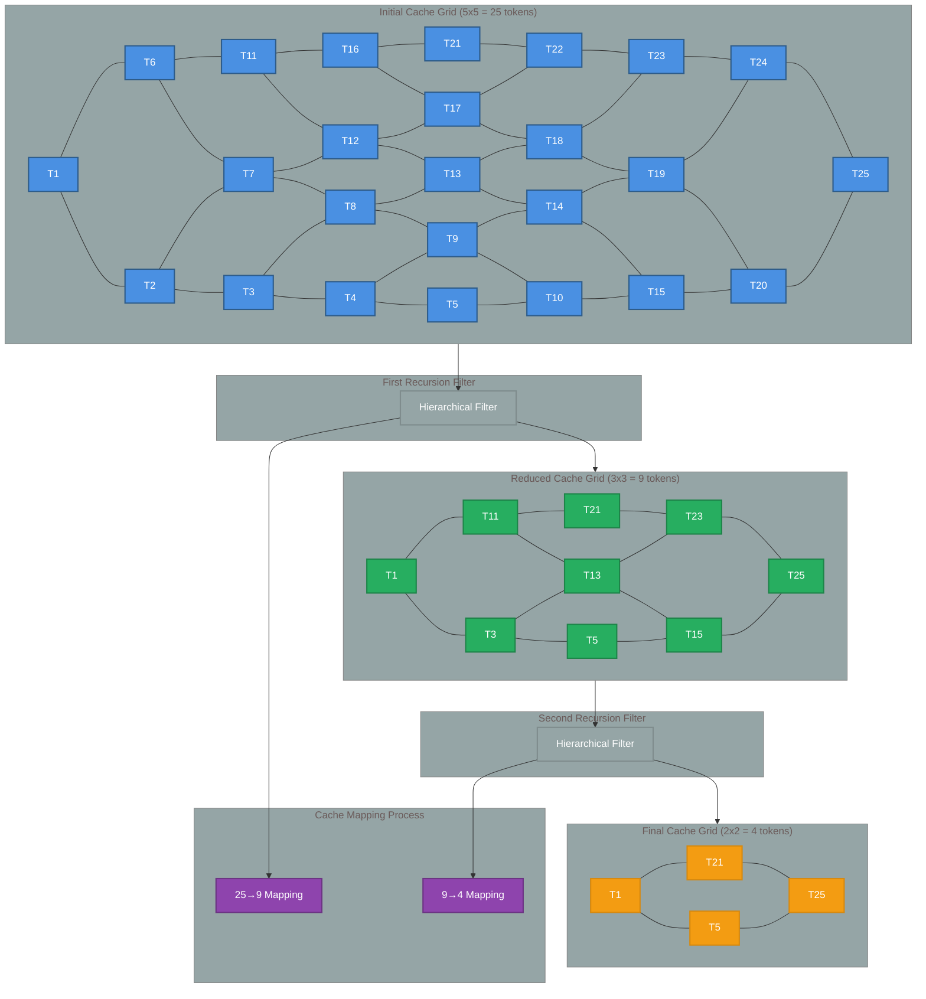

# Background

# Result


## Mixture of Depths

Mixture of Depths (MoD) is an optimization technique for transformer models that allows different tokens to use varying amounts of computation by selectively routing tokens through layers. Instead of processing every token through every layer, MoD uses learned routing scores to determine which tokens receive full self-attention computation and which can skip layers with just residual connections. This adaptive approach exploits the natural variation in token complexity—simple tokens like "the" or "and" require less processing than semantically rich tokens—achieving 2-3x inference speedup with minimal quality degradation by dynamically allocating computational resources where they're most needed.

*Reference: Raposo, D., Ritter, S., Santoro, A., Wayne, G., Weber, T., Botvinick, M., van Hasselt, H., & Song, F. (2024). Mixture-of-Depths: Dynamically allocating compute in transformer-based language models. arXiv preprint arXiv:2404.02258.*



<div align="center" style="margin-top: 20px; padding: 15px;; border-radius: 8px>

**MoD Token Filtering Process** 🔵 (Active tokens) 🔴 (Elimintaed Tokens)

*The Mixture of Depths (MoD) algorithm progressively reduces the token set through recursive filtering, retaining only the most semantically relevant tokens for downstream processing.*

</div>


## Mixture of Recursions

Mixture of Recursions (MoR) extends the efficiency principles of Mixture of Depths by introducing hierarchical token filtering through recursive processing stages. While MoD focuses on layer-wise token routing within a single forward pass, MoR applies token-level selection across multiple recursive iterations, progressively refining the active token set at each stage. Inspired by both MoD's adaptive computation allocation and token-level pruning techniques, MoR creates a multi-stage filtering pipeline where tokens compete for computational resources across recursive depths rather than transformer layers. This hierarchical approach allows for more aggressive token reduction while maintaining semantic coherence, as each recursive stage can focus on increasingly refined subsets of the most relevant tokens, potentially achieving even greater efficiency gains than traditional depth-based routing methods.

*Note: This appears to be a novel approach building on established MoD principles - specific citation pending publication.*




<div align="center" style="margin-top: 20px; padding: 15px;; border-radius: 8px>

**MoR Token Filtering Process** 🔵 (Active tokens) 🔴 (Elimintaed Tokens)

*The Mixture of Ranks (MoR) algorithm progressively reduces the token set through recursive filtering, retaining only the most semantically relevant tokens for downstream processing.*

</div>

## Caching Mechanisms: MoD vs MoR

The caching mechanism is a critical optimization in both MoD and MoR approaches, but they differ significantly in their implementation and efficiency. In MoD, caching occurs at the layer level where skipped tokens maintain their previous layer representations, requiring cache invalidation and updates as tokens move through different routing decisions across layers. MoR introduces a more sophisticated hierarchical caching system that leverages the recursive nature of its filtering process, allowing for persistent token state across recursive iterations and enabling more efficient cache reuse patterns.



<div align="center" style="margin-top: 20px; padding: 15px; border-radius: 8px">

**MoR Hierarchical Cache Reduction** � (Initial (25 tokens) 🟢 (Filtered 9 tokens) 🟡 (Final 4 tokens) 🟣 (Mapping Process)

*MoR progressively reduces cache size from 5x5 grid (25 tokens) → 3x3 grid (9 tokens) → 2x2 grid (4 tokens), with efficient mapping between recursive stages maintaining spatial relationships and reducing memory footprint by 84%.*

</div>

### Computational Efficiency Analysis

**Traditional MoD Approach (3 × 5×5 grids):**
- Memory Operations: 3 × (5² = 25) = **75 cache entries**
- Attention Complexity: 3 × O(25²) = **3 × 625 = 1,875 operations**
- Cache Invalidations: High frequency due to layer-wise routing changes
- Total Memory Footprint: **75 × d_model bytes** (constant across layers)

**MoR Hierarchical Approach (5×5 → 3×3 → 2×2):**
- Memory Operations: 25 + 9 + 4 = **38 cache entries** (49% reduction)
- Attention Complexity: O(25²) + O(9²) + O(4²) = 625 + 81 + 16 = **722 operations** (62% reduction)
- Cache Invalidations: Minimal due to hierarchical persistence
- Total Memory Footprint: **Progressive reduction** from 25d to 4d model bytes

### Intermediary Mapping Matrices

MoR maintains efficient token relationships through sparse mapping matrices between recursion levels:

**First Mapping Matrix (25→9):**
```
M₁ ∈ ℝ^(9×25) where M₁[i,j] = {
  1 if token j maps to position i in reduced grid
  0 otherwise
}
```
- Sparsity: 9/25 = 36% non-zero entries
- Storage: 9 indices instead of 225 full matrix entries

**Second Mapping Matrix (9→4):**
```
M₂ ∈ ℝ^(4×9) where M₂[i,j] = {
  1 if token j maps to position i in final grid
  0 otherwise
}
```
- Sparsity: 4/9 = 44% non-zero entries
- Storage: 4 indices instead of 36 full matrix entries

### Efficiency Gains:

**Memory Efficiency:**
- Traditional: 75 cache entries across 3 layers
- MoR: 38 cache entries with progressive reduction
- **Savings: 49% memory reduction**

**Computational Efficiency:**
- Traditional: 1,875 attention operations
- MoR: 722 attention operations  
- **Savings: 62% computational reduction**

**Cache Management:**
- Traditional: O(n) invalidations per layer transition
- MoR: O(log n) mapping updates per recursion
- **Savings: Logarithmic vs linear cache management overhead**

The hierarchical structure enables **compound efficiency gains** where both memory and computation scale favorably, while sparse mapping matrices maintain token relationships with minimal overhead.