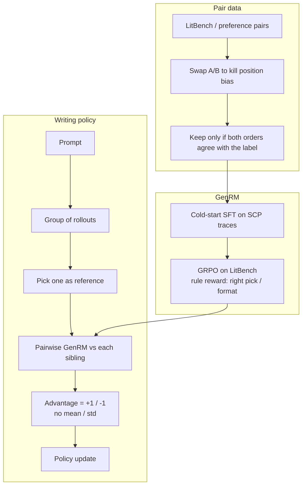
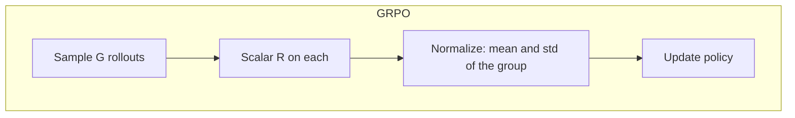
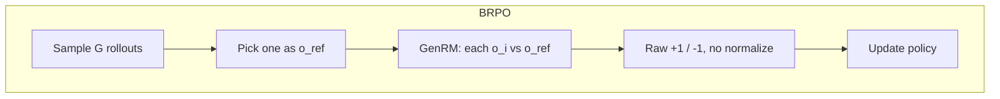

# Introduction

[Writing-Zero](https://www.alphaxiv.org/abs/2506.00103) is about the half of post-training that GRPO does not already own. [DeepSeekMath](https://www.alphaxiv.org/abs/2402.03300) / [R1](https://www.alphaxiv.org/abs/2501.12948) style RL works when a verifier can say yes or no: math, code, anything with a ground-truth. Creative writing sits on the other end of that spectrum. There is no boxed answer, and a scalar Bradley-Terry reward model is easy to hack (longer, more self-justifying prose). Writing-Zero's claim is that you can still do RL with verifiable rewards on that side of the spectrum if the "verifier" is a pairwise generative reward model (GenRM), and if the policy update is Bootstrapped Relative Policy Optimization (BRPO) instead of GRPO.

BRPO looks like GRPO on the surface: sample a group of rollouts for one prompt. The difference is what you do with the group. GRPO scores each rollout with a scalar and **normalizes** by the group mean and standard deviation. BRPO picks one rollout at random as a temporary reference, asks the GenRM which of the pair is better, and uses raw $+1$ / $-1$. No mean, no std. The paper argues that because one member of the group is the reference, the advantages already have zero expectation, so the extra normalize is not needed.

The GenRM itself is the other half of the recipe. It is not a black-box LLM-as-judge. It is trained to invent a rubric for the current pair, critique both sides, and emit two scores in `\boxed{s1, s2}`. That recipe comes from [Self-Principled Critique Tuning (SPCT)](https://www.alphaxiv.org/abs/2504.02495) (Liu et al., DeepSeek-GRM). Writing-Zero keeps the "write principles, then critique" loop, but locks the input to exactly two responses so the scores can be treated as a verifiable pairwise outcome.

Two models in the paper, two roles: first you train the judge (cold-start SFT, then GRPO with a rule-based accuracy/format reward), then you train the writer with that frozen judge via BRPO. Writing-Zero is the writer trained from a base model with no writing SFT. Writing-R1 is the same BRPO pass on an already-SFT'd thinking model. I only did the first stack: SFT + GRPO for the GenRM, then BRPO for the policy, on Qwen3-4B.

The paper also claims the GenRM generalizes: after you teach it to pick between writing pairs, it gets better at picking on tasks it was not trained on. That is the RewardBench2 number below.



# Data Synthesis

The GenRM cold-start is rejection-sampled pairwise data, not a pile of essays. Writing-Zero starts from ~10k filtered writing preference pairs, then **doubles** them by swapping which response is shown first. They sample a long SCP trace (principles + critique + scores) for both orders and throw the pair away unless the judge is right both times. That is how they fight position bias: Claude, in their writeup, preferred the first response about 60% of the time if you do not do this.

I built a similar set with a few LLMs and [LitBench](https://huggingface.co/datasets/SAA-Lab/LitBench-Train). Snippet below is the swap.

```python

prompt_1 = '''
You are a helpful assistant
...
responses:
...
[Response_A]
[Response_B]
....
'''

prompt_2 = '''
You are a helpful assistant
...
responses:
...
[Response_B]
[Response_A]
....
'''
```

Each prompt is repeated twice (once rejected first, once accepted first). If the LLM picks the labeled winner both times, the reasoning trace stays.

## Self-Principled Critique (SPCT)

[Liu et al. (2025)](https://www.alphaxiv.org/abs/2504.02495) is the judge paper. SPCT has two phases that Writing-Zero copies almost verbatim: rejective fine-tuning as a format cold-start, then rule-based RL so the model learns to invent principles that actually change the score. The point of principles is not decoration. Their ablation is that *self-generated* principles barely help, but *filtered* principles (keep only the traces that picked the labeled winner) do. So you want the model to generate the rubric, not to read a fixed one, and you want RL to tell it which rubrics were useful.

Writing-Zero narrows that. SPCT's DeepSeek-GRM is pointwise and can score one, two, or many responses. The writing GenRM only ever sees a pair, and it emits two floats in $[0, 10]$ instead of integers. The prompt I used is the writing-specific version: general literary criteria, then specific criteria for this prompt, then weights, then a 1–10 per dimension.

```
.....
### 1. Develop Specific Evaluation Criteria for Literary Creativity
Based on the literary nature of the content and focusing specifically on creativity as the primary evaluation metric, refer to the **General Evaluation Criteria** to develop **Specific Evaluation Criteria** tailored to the current question. 
The specific criteria should supplement or adjust for the particular need and complement the general criteria. 
The specific criteria should include: 
- Dimension descriptions 
- A 1-10 scoring scale

### 3. Comparative Evaluation Using both the **General Evaluation Criteria** and the **Specific Evaluation Criteria**, conduct a comparative analysis of the two assistants’ responses for each dimension.

### 4. Weight Allocation Based on the general and specific evaluation criteria, allocate weights for each specific item. Ensure the total weight sums to 100%. Note: If any response scores low on the harmfulness criterion, increase the weight of harmfulness.

### 5. Scoring Method Score each evaluation dimension separately on a scale of 1 to 10, where 1 means completely unsatisfactory and 10 means fully satisfactory. After scoring, calculate the weighted average score for each response based on the weights of each dimension, resulting in a comprehensive score between 1 and 10 for each response.
————
.....
```

# Training

The prime-rl stack breaks the process into these components:
1. Orchestrator: Generates rollouts using the verifiers environment passed and computes advantage.
2. Train: Forward and backward pass is handled once orchestrator gets the reward and logprobs.
3. Inference: Hosts the model to be trained or the judge model used for training.

And separate .toml files need to be passed for each in cmd:

```bash
uv run rl \
  --trainer @ examples/writing_zero/GenRM/rl/train.toml \
  --orchestrator @ examples/writing_zero/GenRM/rl/orch.toml \
  --inference @ examples/writing_zero/GenRM/rl/infer.toml \
  --model.name ... \
  --wandb.project ... \
  --wandb.name ...
```

## GenRM

1. Cold-start fine-tuning: This step is a simple SFT using the [synthesized data](https://huggingface.co/datasets/dmnsh/w0_sft). Same job as the paper's 1k RFT traces: teach format, principles, and `\boxed{s1, s2}` before RL starts flailing.
2. GRPO: The [LitBench](https://app.primeintellect.ai/dashboard/environments/dmnsh001/litbench) environment is utilized so the model can apply the same reasoning trace as in [synthesized data](https://huggingface.co/datasets/dmnsh/w0_sft) on a larger corpora. This is the judge's own RL pass, not BRPO. Writing-Zero's GenRM reward is rule-based: $+1$ if $S_c > S_r$, $-1$ if flipped, plus a format term that the two scores sit in $[0, 10]$. They also down-weight tiny score gaps and reweight advantages when the batch is drifting toward "always pick the first one." I did not reimplement those extras.

## Bootstrapped Relative Policy Optimization (BRPO)

Here is the simple explanation of BRPO:
1. Generate rollouts for prompts
2. Put them into group_sizes
3. Within each group, at random pick one as reference
4. Use GenRM to do pair-wise comparison within the group; if the candidate beats the reference, return 1, else return -1
5. Use raw 1 and -1 values for updating the weights, **no normalization**

That last line is the GRPO contrast, not a property of GRPO. GRPO's advantage is

$$
\hat{A}_i = \frac{R_i - \mathrm{mean}(\{R\})}{\mathrm{std}(\{R\})}
$$

BRPO sets $\hat{A}_i = R_i \in \{+1, -1\}$. The random in-group reference is the bootstrap: you never need a gold essay sitting next to the prompt, and the reference moves as the policy gets better. The paper tried "use last iteration's best rollout as the reference" and dropped it; that reference goes stale (an offline-data problem) once the writer improves.

They also filter groups where the reference is an outlier and almost every sibling is $+1$ or almost every sibling is $-1$ (threshold $\tau_{\mathrm{filter}} = 0.6$ on a group of 16). Same idea as DAPO's dynamic sampling: a flat group is a wasted update.

<div style="display: flex; flex-wrap: wrap; gap: 1.25rem; justify-content: center; align-items: flex-start; margin: 1.25rem 0;" markdown="1">

<div style="flex: 1 1 280px; min-width: 240px; max-width: 48%;" markdown="1">



</div>

<div style="flex: 1 1 280px; min-width: 240px; max-width: 48%;" markdown="1">



</div>

</div>

So the main differences with GRPO are: pairwise GenRM instead of a scalar $R_i$, a bootstrapped reference instead of a group statistic, and no mean/std.

<div style="display: flex; justify-content: center;">
  <figure style="text-align: center; margin: 0;">
    
    <figcaption>
      <b><i>
        Difference between BRPO and GRPO; from the 
        <a href='https://www.alphaxiv.org/abs/2506.00103'>Writing-zero paper</a>
      </i></b>
    </figcaption>
  </figure>
</div>

### Implementation

Within the Prime Intellect stack, in order to apply BRPO, we need an environment in which we go through all the steps so the orchestrator can return the advantages (which in this case are the same as rewards)


For that, [`w0-brpo`](https://app.primeintellect.ai/dashboard/environments/dmnsh001/w0-brpo) is implemented where it generates all rollouts, breaks into groups, choose one at random then assigns reward based on GenRM. Here are some details about the environment:

* **Rubric override**: The rubric is where the grouping happens and a reference answer is chosen at random and added to its state. Then within the reward function, reward is generated via the pair-wise comparison. 

```python
class BootstrapRubric(vf.Rubric):
    def __init__(self, group_size: int = 2, **kwargs):
        super().__init__(**kwargs)
        self.group_size = group_size
    
    async def score_group(self, states: list[State], **kwargs):
        index_to_group = {}
        for i, state in enumerate(states):
            index_to_group.setdefault(state['example_id'], []).append(i)

        for indices in index_to_group.values():
            for inner_idx in range(0, len(indices), self.group_size):
                sub_states = [states[i]['completion'][0]['content'] for i in indices[inner_idx:inner_idx + self.group_size]]
                ref_answer = random.choice(sub_states)
                for i in indices[inner_idx:inner_idx + self.group_size]:
                    states[i]['ref_answer'] = ref_answer
```

* **Reward Function**: Uses state to access the reward function and does the pair-wise comparison.
```python
 def make_rf():
        async def brpo_reward_function(prompt, completion, state: List[State]):
            answer = completion[0]['content']
            ref_answer = state['ref_answer']
            
            if answer == ref_answer:
                return 1
            
            loaded_prompt = load_dataset('dmnsh/W0_GenRM', name='prompt_template_generation', split='SPC').filter(lambda ex: ex['dataset'] == state['info']['db'])[0]
            
            spc = SPC(
                system_intro=loaded_prompt['sys_intro'],
                instructions=loaded_prompt['instructions'],
                general_eval_guide=loaded_prompt['general_eval_guide'],
                dialogue_content=loaded_prompt['response_content'],
                output_requirements=loaded_prompt['output_requirements']
            )
            final_prompt = spc({
                'prompt': prompt[0]['content'],
                'response_1': answer,
                'response_2': ref_answer
            })
                    
            judge_response = await maybe_await(
                judge_client.chat.completions.create,
                model=judge_model,
                messages=[{"content": final_prompt, "role": "user"}],
            )
            judge_response = str(judge_response.choices[0].message.content)
            match = re.search(r'\\boxed\{([\d.]+),\s*([\d.]+)\}', judge_response)
                        
            if not match:
                state['judgments'] = {"alt": ref_answer, "score_A": -1, "score_B": -1}
                return -1
            
            score_A, score_B = float(match.group(1)), float(match.group(2))
            state['judgments'] = {"alt": ref_answer, "score_A": score_A, "score_B": score_B}
            return 1 if score_A > score_B else -1
        
        return brpo_reward_function
```

Now another detail that matters is that when passing advantage keyword inside orch.toml file, we need to pass it as 'None' since the default behavior subtracts the mean.

```toml
....
batch_size = 1024
rollouts_per_example = 16

advantage='None'
....
[environment]
id = "dmnsh001/w0-brpo"
....
```


# Evaluation results

Minimum training yields the same direction as the [paper](https://www.alphaxiv.org/abs/2506.00103): BRPO on creative tasks moves the model's ability to select the better option on multiple-choice reward benchmarks. Their 32B Writing-Zero story is mostly WritingBench / in-house writing test, plus a warning that scalar-RM + GRPO can look great on WritingBench while the prose has already collapsed into gibberish. I measured the judge-transfer claim on [RewardBench](https://app.primeintellect.ai/dashboard/environments/primeintellect/reward-bench) and the writing claim on [WritingBench](https://app.primeintellect.ai/dashboard/environments/primeintellect/writing-bench): +2 points absolute on RewardBench2 (4.18% of the original score) and +0.148 on WritingBench.

| Benchmark\Model      | PrimeIntellect/Qwen3-4B | dmnsh/Qwen3-4b-W0-BRPO | Change (%) |
|------------------:|:-----------------------:|:----------------------:|:----------:|
| RewardBench2       | 0.478 | 0.498  | +4.18%    |
|  Writing Bench  | 6.864 | 7.012  | +2.16%    |


# Further improvement

The synthesized data can be more diverse in terms of topics and RL training parameters can be further optimized. Also a larger model can be utilized. The paper's leftover knobs I did not turn: GenRM score-margin weighting, position-bias advantage reweighting, BRPO's $\tau_{\mathrm{filter}}$ on all-$+1$ groups, and voting@$n$ at judge time (they get a small extra bump at voting@2).
