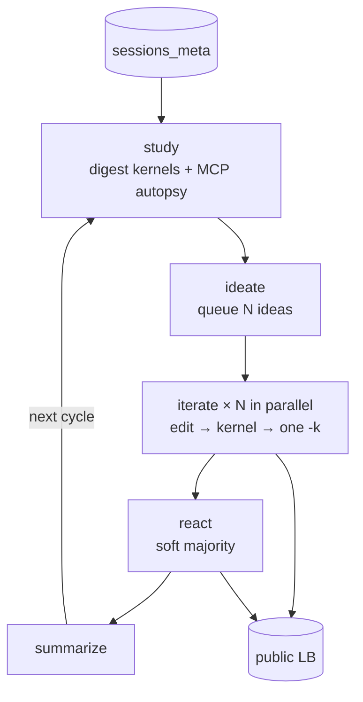

<style>
.ar-fig {
  display: block;
  text-align: center;
  margin: 1.35rem auto 1.7rem;
  max-width: 980px;
}
.ar-fig img { width: 100%; height: auto; border-radius: 6px; }
.ar-fig figcaption {
  margin: 0.4rem auto 0;
  max-width: 38rem;
  font-size: 0.82em;
  line-height: 1.45;
  opacity: 0.78;
  color: var(--text-muted);
  text-align: center;
}
.ar-call {
  max-width: 42rem;
  margin: 1.4rem auto 1.7rem;
  padding: 0.85rem 1.1rem;
  border-left: 3px solid #8aa8bc;
  background: color-mix(in srgb, var(--text-muted) 8%, transparent);
  font-size: 0.95em;
  line-height: 1.5;
}
.ar-mcp-row {
  display: flex;
  flex-wrap: nowrap;
  gap: 0.7rem;
  margin: 1.2rem auto 1.7rem;
  max-width: 1080px;
  align-items: stretch;
  overflow-x: auto;
  padding-bottom: 0.25rem;
}
.ar-mcp-card {
  flex: 1 1 0;
  min-width: 200px;
  margin: 0;
  border: 1px solid color-mix(in srgb, var(--text-muted) 28%, transparent);
  border-radius: 8px;
  background: color-mix(in srgb, var(--text-muted) 6%, transparent);
  overflow: hidden;
  display: flex;
  flex-direction: column;
}
.ar-mcp-card header {
  font-size: 0.72em;
  letter-spacing: 0.03em;
  text-transform: uppercase;
  padding: 0.45rem 0.65rem 0.35rem;
  border-bottom: 1px solid color-mix(in srgb, var(--text-muted) 22%, transparent);
  color: var(--text-muted);
  font-family: ui-monospace, SFMono-Regular, Menlo, Consolas, monospace;
}
.ar-mcp-card header b {
  color: var(--text);
  font-weight: 600;
  text-transform: none;
  letter-spacing: 0;
  font-size: 1.08em;
}
.ar-mcp-card pre {
  margin: 0;
  padding: 0.55rem 0.65rem 0.7rem;
  font-size: 0.68em;
  line-height: 1.4;
  overflow: hidden;
  white-space: pre-wrap;
  word-break: break-word;
  flex: 1;
}
.ar-mcp-card .q { color: #8a3a32; }
.ar-mcp-card .k { color: #2f4a5c; }
.ar-mcp-card .ok { color: #3a6b4a; }
@media (max-width: 700px) {
  .ar-mcp-row { flex-wrap: wrap; }
  .ar-mcp-card { flex: 1 1 240px; }
}
.chart-row-2 {
  display: flex;
  flex-wrap: wrap;
  align-items: flex-start;
  gap: 1.5rem;
  margin: 1.25rem auto 1.75rem;
  max-width: 1080px;
}
.chart-row-2 > .blog-plotly-figure {
  flex: 1 1 320px;
  min-width: 260px;
  max-width: none !important;
  margin: 0 !important;
}
.chart-row-2 > .blog-plotly-figure figcaption {
  margin: 0.35rem auto 0;
  max-width: 36rem;
  font-size: 0.82em;
  line-height: 1.45;
  opacity: 0.78;
  color: var(--text-muted);
  text-align: center;
}
@media (max-width: 700px) {
  .chart-row-2 { flex-direction: column; }
  .chart-row-2 > .blog-plotly-figure { flex: 1 1 auto; width: 100%; }
}
</style>

I built **Kag**: an [OpenCode](https://opencode.ai) fork with a slot TUI that runs a Kaggle competition as a cycle machine. The target was [Rogii wellbore geology](https://www.kaggle.com/competitions/rogii-wellbore-geology-prediction). Public LB only. Best confirmed score I still trust is **7.584**, from a quota-probe dual pipeline, against a community top of **4.679**. After that win the harness *does* return to the family — as a seed, not as a search. After a 11552 it retires the family forever. The ambitious lines in between get one timeout, then a HANDOFF. [Kirgis, Kapoor, et al.](https://www.alphaxiv.org/abs/2607.27191) saw the same pair on unpublished NeurIPS questions: ambitious hypothesis gone in the first fifteen hours, then the run declares itself done with budget left.

This is a mid-build note. I do not want to oversell a medal I do not have.

# Introduction

Kaggle remote is a long-horizon task pretending to be a coding task. You have to pull other people’s kernels, write a digest, queue N ideas against GPU/CPU slots, push a kernel, wait for COMPLETE, then spend one of five daily `-k` submits. The metric the competition cares about is public LB. Local CV on this set is known to anti-correlate. So the agent cannot smoke-test its way to a number. It has to wait on Kaggle, then remember what it was doing yesterday.

Kag is the harness I wanted for that loop. Orchestrator stays in plan/build. Sub-agents are titled `kr-c{cycle}-{stage}`. Iterate slots run in parallel. A soft majority barrier starts react when more than half the launched slots are terminal, so one stuck kernel does not freeze the cycle. Study is supposed to autopsy *our* prior work, not just scrape the leaderboard.

There were two eras. June was Qwen3.6-27B on a **local `val_rmse` harness** (best I still believe is **14.87** against a naive 15.26). July I cut the local gate and ran **kaggle-remote**: Ornith-1.0-35B as the iterate workhorse, Laguna-S-2.1 for a restart, DeepSeek V4 Flash for an earlier parallel-retry wave. Same competition. Different contract. Same ways of quitting.

# Why this harness

The program is boring on purpose.

```
study → ideate → iterate×N → react → summarize
```



`N = min(iters_per_cycle, free GPU+CPU)` after subtracting `in_flight.tsv`. Iterate may only submit through `scripts/kaggle-competition-submit.sh` (push → poll COMPLETE → one `-k`). No local smoke. Thinking has to land in `edits.md` / `doc.md` / `submit/report.md`, and every edit chunk is supposed to be a commit.

The first harness (June 18) had more stages than I needed: curator, benchmark sidecars, EDA, a `val_rmse` gate, a separate submit stage, an LP runbook. June 24 I forked OpenCode and moved scoring onto Kaggle. July 18 I renamed waves to cycles, dropped the runbook, and wrote **public LB only** into the contract. `harness.py` is still in the tree. Iterate is forbidden to use it. If the agent cannot finish one idea under five daily `-k`s, adding MCTS will not save it.

The TUI is just instrumentation. Slot boxes bound to `kr-c…-iterate`. Log tail. A **Self** panel that prints the MCP calls I want the next study agent to paste.

Study writes a `family:` on every `ideas.md`. React is supposed to keep `persist/inspiration.tsv` as the running category ledger, and to pick a **60% exploit / 40% explore** mix from underused non-retired families. That is the diversity table. It is why I thought the loop could stay structured *and* still change its mind.

## Is the loop more dynamic?

No. Not compared to the benches that actually search.

[AIDE](https://www.alphaxiv.org/abs/2502.13138) keeps a **solution tree**. Draft a fresh program, Debug a crash, Improve a working node. The next action is whichever child looks best on the proxy metric. [AIRA](https://www.alphaxiv.org/abs/2507.02554) makes that explicit: a policy (greedy / MCTS / evolutionary) plus an operator set. Once they rewrote the operators, MCTS moved medals. [PaperBench](https://www.alphaxiv.org/abs/2504.01848) had to invent **IterativeAgent** so o1 would not quit after one draft. [FML-bench](https://www.alphaxiv.org/abs/2605.17373) treats “which scaffold” as “which search dynamic.” [Kirgis et al.](https://www.alphaxiv.org/abs/2607.27191) is the other extreme: six days, no stages, still drops the hypothesis in the first fifteen hours.

Kag is a **cycle machine**. Study, ideate, launch N slots, react when more than half are terminal, summarize, repeat. The only dynamic knobs are capacity math (`N` shrinks while stragglers sit in `in_flight.tsv`) and the soft majority barrier. That is scheduling. It is not a tree. One iterate session owns one idea; HANDOFF is terminal; there is no Improve-on-best-node inside the slot. Parallel slots look busier than AIDE’s sequential expand. They are not more willing to keep a line.

What *is* more Kaggle-shaped than AIDE: study has three tracks (score / votes / our submits), the metric is public LB not 5-fold CV, and the next cycle is supposed to read MCP instead of the agent’s own `doc.md`. That is memory across days. It is not a search policy. I wrote “if the agent cannot finish one idea, adding MCTS will not save it.” The traces still make me want a keep-asking iterate. I have not shipped it.

# Public LB

I pulled `kaggle competitions submissions -c rogii-wellbore-geology-prediction` today. **34** rows. **32** have a public score. Two July-27 kernels (`c1-s01` likpf retry, `c2-s01` trend refine) are still COMPLETE with an empty score. Lower is better.

The hill-climb is one afternoon in June. Quota probe **7.584** public / **9.640** private. Dual-pipe **7.679** / **9.598** — worse on public, slightly better on private. Community top is **4.679**. Everything after June 26 is either a ~16 plateau or a blowup. Best-so-far never moves again.

**8 / 32** scored submits are >100 (25%). **10 / 32** are >20. That is the error rate I will cite: one in four kernels is a unit-scale disaster, not a near miss. The jaemin PF that wrote `5.3` is in that pile.

<div class="chart-row-2">
<figure class="blog-plotly-figure">
<div id="kag-lb-all" style="width:100%;height:340px;"></div>
<figcaption>Every scored submit. Log y. Blue ≤20, red &gt;20, grey = still empty.</figcaption>
</figure>
<figure class="blog-plotly-figure">
<div id="kag-lb-best" style="width:100%;height:340px;"></div>
<figcaption>Best-so-far public LB, clipped to 20. Gold line is community 4.679. The only step down is June 26.</figcaption>
</figure>
</div>

<script>
window.KAG_SUBS = [{"t":"2026-06-23T14:23:00","d":"iter-29 seanlode structure smoke","pub":15.826,"priv":14.756,"best":15.826},{"t":"2026-06-23T14:27:25","d":"(untitled)","pub":15.826,"priv":14.756,"best":15.826},{"t":"2026-06-24T19:22:55","d":"iter-45 stacked ridge OT global best","pub":16.089,"priv":15.141,"best":15.826},{"t":"2026-06-24T20:16:59","d":"iter-41 parallel OT routing val 14.874","pub":15.995,"priv":15.009,"best":15.826},{"t":"2026-06-25T02:09:16","d":"(untitled)","pub":15.999,"priv":15.012,"best":15.826},{"t":"2026-06-25T03:39:31","d":"iter-44 no-wait","pub":15.915,"priv":14.989,"best":15.826},{"t":"2026-06-25T04:00:58","d":"iter-35 lb batch 20260625","pub":15.649,"priv":14.979,"best":15.649},{"t":"2026-06-25T04:07:06","d":"iter-35 fixed submit","pub":15.649,"priv":14.979,"best":15.649},{"t":"2026-06-25T04:07:07","d":"iter-43 fixed submit","pub":16.019,"priv":15.07,"best":15.649},{"t":"2026-06-26T19:00:53","d":"quota probe","pub":7.584,"priv":9.64,"best":7.584},{"t":"2026-06-26T19:02:21","d":"iter-49 attention stack","pub":16.129,"priv":15.158,"best":7.584},{"t":"2026-06-26T19:10:17","d":"dual pipeline w0.58/0.42 + guarded override","pub":7.679,"priv":9.598,"best":7.584},{"t":"2026-07-15T17:54:17","d":"w1-s04 dwt unet segmentation","pub":11551.955,"priv":11654.855,"best":7.584},{"t":"2026-07-15T17:57:49","d":"w1-s05 dual pipeline xgb+lgb","pub":15.907,"priv":14.512,"best":7.584},{"t":"2026-07-15T18:09:20","d":"xgb+lgb ensemble w/ geo features","pub":132.15,"priv":76.964,"best":7.584},{"t":"2026-07-15T19:37:46","d":"Ridge engineered features 200 wells","pub":8579.452,"priv":8683.352,"best":7.584},{"t":"2026-07-16T16:35:18","d":"w1-s05 decorrelated physics pipeline","pub":74.675,"priv":71.286,"best":7.584},{"t":"2026-07-16T17:13:43","d":"c1-w1-s04 prefix calibrated track","pub":1306.248,"priv":1265.212,"best":7.584},{"t":"2026-07-16T17:30:24","d":"w1-s01 dual pipeline rebuild","pub":201.595,"priv":222.137,"best":7.584},{"t":"2026-07-16T18:39:06","d":"c1-w1-s03 super solution features","pub":104.659,"priv":120.038,"best":7.584},{"t":"2026-07-16T21:21:11","d":"c1-w1-s02 xgb residual hillclimb","pub":19.131,"priv":18.582,"best":7.584},{"t":"2026-07-17T00:03:03","d":"w2-s02 dual-pipeline-simpler","pub":15.896,"priv":14.499,"best":7.584},{"t":"2026-07-17T00:06:53","d":"w2-s03 ensemble s01+s02","pub":15.841,"priv":14.571,"best":7.584},{"t":"2026-07-17T00:19:14","d":"w2-s03 ensemble s01+s02 v2","pub":15.841,"priv":14.571,"best":7.584},{"t":"2026-07-17T05:29:49","d":"w3-s02 dual-pipeline-drift-blend","pub":16.081,"priv":14.746,"best":7.584},{"t":"2026-07-17T05:31:31","d":"w3-s01 nnls-ensemble-drift","pub":16.212,"priv":14.966,"best":7.584},{"t":"2026-07-18T01:13:44","d":"w1-s03 seed-ensemble-ridge","pub":7649.507,"priv":8324.266,"best":7.584},{"t":"2026-07-18T06:14:09","d":"w1-s03 ridge-anchor-refinement","pub":15.883,"priv":14.488,"best":7.584},{"t":"2026-07-18T06:47:01","d":"w1-s02 particle-filter-beam-search v3","pub":15.883,"priv":14.488,"best":7.584},{"t":"2026-07-18T07:09:39","d":"w1-s04 target-free-tvt-geosteering","pub":4848.686,"priv":4965.029,"best":7.584},{"t":"2026-07-18T07:09:57","d":"w1-s05 typewell-matching-lightgbm","pub":15.883,"priv":14.488,"best":7.584},{"t":"2026-07-27T02:24:12","d":"c1-s01 exploit-dual-pipeline-likpf-retry","pub":null,"priv":null,"best":7.584},{"t":"2026-07-27T03:04:25","d":"c1-s02 explore-multi-scale-pf-jaemin","pub":4962.52,"priv":5015.135,"best":7.584},{"t":"2026-07-27T03:29:02","d":"c2-s01 dual-pipeline-trend-refine","pub":null,"priv":null,"best":7.584}];
document.addEventListener('DOMContentLoaded', function () {
  if (typeof Plotly === 'undefined') return;
  var rows = window.KAG_SUBS;
  var ok = rows.filter(function (r) { return r.pub != null && r.pub <= 20; });
  var bad = rows.filter(function (r) { return r.pub != null && r.pub > 20; });
  var pend = rows.filter(function (r) { return r.pub == null; });
  var tip = function (r) {
    return r.d + '<br>' + r.t.replace('T', ' ') + '<br>public ' + (r.pub == null ? 'empty' : r.pub) +
      (r.priv == null ? '' : ' / private ' + r.priv) + '<extra></extra>';
  };
  Plotly.newPlot('kag-lb-all', [
    { name: '≤20', type: 'scatter', mode: 'markers', x: ok.map(function (r) { return r.t; }), y: ok.map(function (r) { return r.pub; }),
      text: ok.map(tip), hovertemplate: '%{text}', marker: { color: '#7aafd4', size: 9 } },
    { name: '>20', type: 'scatter', mode: 'markers', x: bad.map(function (r) { return r.t; }), y: bad.map(function (r) { return r.pub; }),
      text: bad.map(tip), hovertemplate: '%{text}', marker: { color: '#d48a8a', size: 10, symbol: 'x' } },
    { name: 'empty', type: 'scatter', mode: 'markers', x: pend.map(function (r) { return r.t; }), y: pend.map(function () { return 16; }),
      text: pend.map(tip), hovertemplate: '%{text}', marker: { color: '#8f96aa', size: 8, symbol: 'diamond-open' } }
  ], Object.assign({}, blogPlotlyTheme(), {
    height: 340,
    title: { text: 'Public LB (log)', font: { size: 14 } },
    xaxis: { type: 'date', title: { text: '' } },
    yaxis: { type: 'log', title: { text: 'public RMSE' } },
    legend: { orientation: 'h', y: 1.16, x: 0 },
    margin: { t: 72, r: 16, b: 48, l: 56 }
  }), Object.assign({}, blogPlotlyConfig, { displayModeBar: false }));

  var bestX = [], bestY = [], last = null;
  rows.forEach(function (r) {
    if (r.best == null) return;
    if (last !== r.best) { bestX.push(r.t); bestY.push(r.best); last = r.best; }
    else { bestX.push(r.t); bestY.push(r.best); }
  });
  Plotly.newPlot('kag-lb-best', [
    { name: 'best so far', type: 'scatter', mode: 'lines+markers', x: bestX, y: bestY,
      line: { color: '#7aafd4', width: 2.2 }, marker: { size: 6 },
      hovertemplate: '%{x|%b %d}<br>best %{y:.3f}<extra></extra>' },
    { name: 'community 4.679', type: 'scatter', mode: 'lines', x: [rows[0].t, rows[rows.length - 1].t], y: [4.679, 4.679],
      line: { color: '#e8b86d', width: 1.6, dash: 'dash' }, hovertemplate: 'community 4.679<extra></extra>' }
  ], Object.assign({}, blogPlotlyTheme(), {
    height: 340,
    title: { text: 'Best-so-far vs community', font: { size: 14 } },
    xaxis: { type: 'date' },
    yaxis: { title: { text: 'public RMSE' }, range: [4, 17] },
    legend: { orientation: 'h', y: 1.16, x: 0 },
    margin: { t: 72, r: 16, b: 48, l: 56 }
  }), Object.assign({}, blogPlotlyConfig, { displayModeBar: false }));
});
</script>


# Ideas, return, and the ledger

The queue is allowed to be brave. What ships is the seed. The interesting question is whether they **came back** after a number, and whether the category table made them.

## Did they return?

| Family | What happened | Came back? |
|---|---|---|
| dual-pipe (ridge-sp45 + fleongg, 0.58/0.42) | **Win:** 7.584 / 7.679 on June 26 | **Yes**, forever, as `seed_iter`. Not as Improve-on-the-node. Later clones sit at 15.8–16. |
| dual-pipe rebuild | Fail 202 | **Yes** — next day they ship “simpler” and stay on the plateau. |
| dwt U-Net | Fail 11552 | **No.** `retire` / `do_not_repeat`. |
| prefix-calibrated track | Fail 1306 | **No.** Retired. |
| ridge, 200 wells | Fail 8579 | **No.** Retired. |
| seed-ensemble-ridge | Fail 7649 | **No.** Retired. |
| target-free geosteering | Fail 4848 (227s) | **No.** Retired. |
| particle filter | Plateau 15.88 (beam v3, July 18), then jaemin port writes 5.3 | **Yes** they returned to the family. Live Kaggle: **4962.5**. Run died before react could retire it. |
| baidal conservative ensemble | Tagged `unfinished`, 7.201 community | **Queued in c1 outcomes, swapped out** of the c2 queue for trend features. Pivot without a score. |
| MoE / Mamba / HMM (June) | Discard on first flat `val_rmse` | **No.** |
| trend / “wiggle is free” | Queued c2 explore | Two edits, no `-k`. Slot still `running`. |

After a **win** they return, but only to clone. After a **catastrophe** they retire the family and never shrink-and-retry. After a **flat** they either discard (June) or strip the mechanism that worked (timeout → skip GroupKFold → fewer trees → **remove spatial features**). That last one is a pivot inside the slot, and it is the wrong direction: it deletes the thing that made 7.584.

c1 react drafted baidal as next explore. c2 ideate read discussion 727171 and wrote trend features instead. That is a real pivot — and it happened **before** either line had a public score. Kirgis **ineffective backtracking** is the other shape: local debug without a global rethink. Here the global rethink happened on a discussion, not on an LB.

## Did the category table help?

I asked study to tag `family:` on every `ideas.md`. I asked react to update `persist/inspiration.tsv` (`idea_id`, `source`, `notes`) and to follow this mix:

| Signal | What react.md says |
|---|---|
| New best LB | Exploit-heavy; seed on the new best |
| Slot ≫ best LB | Retire family |
| Exploit tweak failed 2× | Retire axis |
| LB flat | More explore |
| Public top ≪ us by >2 | Explore underused non-retired |
| Source overused | Prefer underused |

Default mix ≈ 60/40 exploit/explore. At N=2 that is always 1+1, so the mix is a label, not a census.

**What actually got written**

- `family:` tags exist. jaemin is `multi-scale-pf-ensemble`. baidal is `conservative-profile-ensemble`. Four July score-track kernels are all `dual-pipeline-koolbox-fork`.
- `inspiration.tsv` is still **header only**. React never filled the ledger.
- Autopsy `retire:` / `do_not_repeat` *did* get used. There is no second U-Net. That half of the table worked.
- Study c2 wrote the diversity finding in prose: *“All 4 new score-track kernels are variants of the same dual-pipeline koolbox lineage.”* Then ideate queued dual-pipe trend refine + trend LightGBM — same lineage, new adjectives.

So the family tag helped **as a kill list**. It did not help **as coverage**. “Underused” was never counted because the file that was supposed to count it is empty. AIDE would have kept the winning node in the tree. Kag kept the winning *name* and forgot the underused rows.

**June.** Qwen writes LSTM / MoE / Mamba / HMM / TCN. Iter-40: K-means on typewell GR plus an MLP gate, then discard because 15.29 vs naive 15.26. Iter-32 wants `mamba-ssm`, ships a homemade SSM. First public numbers sit at **15.65–16.13**. June 26 the quota probe pastes the dual pipeline. **7.584**. Attention-stack the same hour is still 16.1. The hill-climb is a kernel we already had.

**July 15–16.** Ideate gets ambitious and the LB punishes it: U-Net 11552, ridge-200 8579, prefix-cal 1306, rebuild 202, xgb+geo 132, super-solution 105, physics 75, residual hillclimb 19.1, dual-pipe fallback 15.9. Then `avoids: full beam search`. Kirgis **uncreative response**: negative result → narrow the claim.

**July 17–18.** Safer clones at 15.84–16.21. PF beam-search v3 lands on **15.88**, not 7.6. Then seed-ensemble-ridge **7649** and geosteering **4848**. Policy becomes “dual pipeline only.”

**July 27.** Exploit: re-submit iter-5 likpf — still **no public score**. Explore: jaemin PF, eight real debugs (NameError, 7 vs 13 features, NaN `gs`, clamp `[0,1000]` on 10k-ft TVT), writes **5.3**. Kaggle: **4962.5**. Trend and baidal do not run. The run stops mid–cycle 2.

The two failure modes I keep seeing are the same ones as the lede. **Abandon:** one blowup retires a family; one timeout strips the win. **Stop short:** HANDOFF after edit_1, or write `5.3†` before Kaggle calculates. AIDE’s keep-asking loop is a scaffold patch on the short-stop. Kag does not have it inside a slot.

<div class="ar-call">
Confirmed scores I will cite: 7.584 (quota probe), 7.679 (dual-pipe guarded override). The 5.3 in the TSV is a story; live Kaggle scored that kernel 4962.5. Catastrophic rows (1306–11552, plus 4962) I do believe — those came back from the LB. Two July-27 rows are still empty.
</div>

# MCP meta-session

Disk lies. `doc.md` is a 50-line story the iterate agent wrote about itself. `queue.md` lists ideas that never ran. `inspiration.tsv` is empty. The halfway work — the particle-filter that compiled, the spatial features that got deleted after a timeout, the HANDOFF that claimed `lb=5.3` (Kaggle later: **4962.5**) — lives in OpenCode SQLite.

`sessions_meta` is a small local MCP over that DB (`opencode-local.db`, then `opencode.db`). Study is required to call it when prior iters exist. Orchestrator calls it on missing HANDOFF. Iterate can call it on its own title after an ERROR.

| Tool | Returns | What it is for |
|---|---|---|
| `session_timeline` | `> THINKING` / `> TOOL CALL` / `> MSG` lines | what they tried and dropped |
| `list_sessions` | JSON `kr-c*` catalog | inventory / majority check |

`query` is a title substring (`kr-c2-i03-iterate`). `filter` is `thinking` / `tool` / `read` / `msg` / `all`. Window with `order` + `n`. I do not want a 300-turn dump into study’s context.

That is the meta-session: a later agent whose evidence channel is MCP, not `grep persist/`. The TUI Self panel is the same calls, for me.

<div class="ar-mcp-row" aria-label="example Kag MCP returns">
<figure class="ar-mcp-card">
<header><b>session_timeline</b> · last n=6</header>
<pre><span class="k">## kr-c1-i02-iterate CPU</span>
> THINKING: PF ensemble… then timeout
> TOOL CALL: edit persist/logs/iter-2/edits.md
> TOOL CALL: bash scripts/kaggle-competition-submit.sh…
> MSG: "removed spatial features, fewer trees"
<span class="q">> THINKING: skip GroupKFold, equal 1/3 weights</span>
> MSG: "HANDOFF lb=pending"</pre>
</figure>
<figure class="ar-mcp-card">
<header><b>list_sessions</b> · cycle=1 stage=iterate</header>
<pre>{
  <span class="k">"pattern"</span>: <span class="ok">"%kr-c1%iterate%"</span>,
  <span class="k">"n"</span>: 4,
  <span class="k">"sessions"</span>: [
    { "title": "kr-c1-i01-iterate GPU" },
    { "title": "kr-c1-i02-iterate CPU" },
    { "title": "kr-c1-i02-iterate CPU v2" },
    { "title": "kr-c1-i04-iterate CPU quick" }
  ]
}</pre>
</figure>
<figure class="ar-mcp-card">
<header><b>autopsy fields</b> · study writes</header>
<pre><span class="k">failed</span>     dwt unet 11552
<span class="k">halfway</span>    iter-5 kernel COMPLETE, API 400
<span class="ok">unfinished</span> baidal ensemble — queued, never ran
<span class="k">build_on</span>   dual-pipe 0.58/0.42</pre>
</figure>
<figure class="ar-mcp-card">
<header><b>what disk missed</b></header>
<pre>queue said: multi-scale PF
edits said: 8 debugs + claim 5.3
CLI said:   <span class="q">PENDING</span>
MCP said:   agent wrote
            lb_scores before
            Kaggle calculated</pre>
</figure>
</div>

This is where it actually helped, twice.

First, autopsy. Cycle-1 study would have re-queued a U-Net if it only read the empty `inspiration.tsv`. MCP + disk retired the 10³ families. Ideate is told to finish `halfway` / `unfinished_ideas` instead. That is how iter-5 (kernel done, submit 400) became a retry. It is also how react caught the 5.3: the iterate message wrote it; live CLI said PENDING. The number that eventually came back was **4962.5**.

Second, **stall recovery**. Laguna’s useful run was not an iterate. `in_flight.tsv` still said slot 04 was running after the edits were done. iter-3 had a kernel stuck 30+ minutes (v7 pushed, v6 still RUNNING). Disk said one thing. The session timeline said another. The plan that came out was operational: clear stale rows, cancel the stuck kernel, query `sessions_meta` for iter-1..5, then hand the box back to Ornith.

Without the timeline, react believes the agent. With it, react can say “pending, unverified.” MCP does not make iterate keep the line. It only lets study see that it dropped.

# What the traces show

I counted OpenCode sessions on the Rogii workspace, not tokens. Titles are messy. Treat the counts as directional.

| Model | Era | Sessions (approx.) | What it actually did |
|---|---|---:|---|
| Qwen3.6-27B | June, local val | ~189 | LSTM / MoE / Mamba / HMM / TCN. Best val **14.87**. Many `resume finish`. |
| DeepSeek V4 Flash | June / mid-July | 60 | Fast parallel retries. Honest discard (`val_rmse=75` vs naive 15). |
| Ornith-1.0-35B | July, public LB | 44 | Real kernels. The 10³ disasters and the fake 5.3 (real **4962.5**). |
| Laguna-S-2.1 | July 25–26 | 8 | Restart / `in_flight` reconcile. Compaction ate iterate. |
| Nemotron 3 Ultra | June 23 | 2 | Study only (70 and 423 output tokens). |

**Qwen** can name the paper move and then refuse to keep it when the first number is flat. The bureaucratic quit is later: a child titled `particle-filter-tvt`, then `resume finish` at 1k–3k tokens to write `doc.md`. The scaffold had to spawn a *new* session to close work the first one walked away from.

**DeepSeek** looks busy (36 `kr-c*` titles in June). A lot of those are “CPU quick” retries in 108–218s. One i04 is the honest abandon: `HANDOFF: val_rmse=75.38, git_action=discard`. I will take a discard over a fake 5.3.

**Ornith** is the production path. After a failed exploit: *“abandon exploit axis, go full explore.”* On iterate, timeout → strip spatial features. Two quits I do not want to forget: `explore-pipea-only` sat **~8.2 hours** on *“No logs yet.”* Geosteering died in **227 seconds**. React sometimes HANDOFFed in **30–99 seconds**. Soft majority then advances on a thin story.

**Laguna** barely iterated. Kag probed llama.cpp `:8080` for `n_ctx` even on `vllm/laguna`, reserved a fake 256k window, usable context ~17k, compact after the first reads. I fixed the probe. The session I keep is the MCP reconcile, not a score.

# Context

The closest writeup I have seen this week is [Kirgis, Kapoor, et al.](https://www.alphaxiv.org/abs/2607.27191): a **shadow evaluation** — unpublished NeurIPS questions, six days, original authors grade. Both papers rejected. Same split as Rogii: engineering works, research judgment does not.

| Their mode | What they saw | What showed up here |
|---|---|---|
| Bar judgment | Claim from a tiny synthetic check | `lb=5.3` while CLI is PENDING; Kaggle later **4962.5** |
| Uncreative response | Negative result → narrow the claim | After 11552, `avoids: full beam search` |
| Ineffective backtracking | Drop the hypothesis in the first ~15h | Timeout → strip spatial features; baidal never ran |
| Poor resource awareness | Finish early, budget left | 8.2h “no logs yet”; cycle 2 left in-flight |
| Instruction drift | Ignore min exploration, review tools | HANDOFF before `-k`; skip `sessions_meta`; empty `inspiration.tsv` |

I am not doing a shadow eval. Their point still holds: a verifiable metric does not mean the agent kept the hypothesis that could move the number.

Some of the ones I paid attention to:

- **[PaperBench](https://www.alphaxiv.org/abs/2504.01848)** : replicate-from-scratch. Code-dev is easy; result match is **0%**. BasicAgent ends early; IterativeAgent exists so o1 would not. That is my jaemin slot.

- **[PostTrainBench](https://www.alphaxiv.org/abs/2603.08640)** : 10h, one H100, post-train a 4B. Best agent **23.2%** vs instruct **51.1%**. Almost nobody runs RL. Many runs die in 2–3h. They see contamination; I see a self-grade lie.

- **[AutoResearchEval / ARFT](https://www.alphaxiv.org/abs/2608.14905)** : **uncorrected self-awareness** in 82.5% of analyses. They want a metacognitive loop. `sessions_meta` is an external one. HANDOFF-is-terminal is a scaffold choice.

- **[MLE-bench](https://www.alphaxiv.org/abs/2410.07095)** / **[AIDE](https://www.alphaxiv.org/abs/2502.13138)** / **[AIRA](https://www.alphaxiv.org/abs/2507.02554)** : Kaggle-shaped search. AIDE’s tree is why it lasts 24h. AIRA’s MCTS only helped after they rewrote operators. Test-vs-val would add 9–13 points — same trap as local CV on Rogii.

- **[FML-bench](https://www.alphaxiv.org/abs/2605.17373)** : agent strategy *is* search dynamics.

- **[HORIZON](https://www.alphaxiv.org/abs/2604.11978)** : planning errors as the chain grows.

- **[Agents Explore but Agents Ignore](https://www.alphaxiv.org/abs/2604.17609)** : useful observation, plan unchanged. Study saw “all koolbox forks”; ideate still queued dual-pipe.

- **[Parsing the Stream](https://www.alphaxiv.org/abs/2609.01466)** / **[OpenRath](https://www.alphaxiv.org/abs/2606.19409)** : why MCP exists. Disk is lossy. The empty TSV is the same bug.

I am not implementing AIRA-dojo, an AIDE tree, a six-day OpenClaw box, or ARFT’s 45-tag judge. Kag is thinner. The miss is that the thin ledger I *did* specify never got a row.

# What should move if this is right

If the family ledger is doing its job, `inspiration.tsv` has a row per `family` with last LB and a `retired|open|unfinished` flag, and the next ideate can point at **underused** instead of another koolbox adjective. After a catastrophe, autopsy should keep a *smaller* next step on that family once, not `retire` on n=1. After a win, iterate should Improve the winning node (blend, override, one PF scale) instead of cloning `0.58/0.42`.

If I see another `resume simple` title, the iterate prompt is still letting HANDOFF fire before `-k`. If I only get more dual-pipeline clones at 7.58, the harness is teaching conservatism. That can be the right lesson after a 11552. It is the wrong lesson if the 3-point gap to 4.679 is still sitting in kernels we already digested — baidal 7.201, jaemin’s actual mechanism, trend — and never ran clean.

# What is actually done

| Piece | State |
|---|---|
| OpenCode fork + `kag` TUI (slots / log / Self) | working |
| Cycle program + submit helper + 5/day cap | working |
| `sessions_meta` (`timeline`, `list_sessions`) | working; study required to call it |
| `ideas.md` `family:` tags | written on study artifacts |
| `inspiration.tsv` category ledger | **empty** — header only |
| Soft majority + `in_flight.tsv` | written; desynced (Laguna had to clear it) |
| Laguna compaction / provider `n_ctx` | fixed after it ate iterate |
| Cycle 2 react / summarize | **not done** — stopped mid-flight July 27 |
| Confirmed LB better than 7.584 | **not done** |
| AIRA-style keep-asking iterate | not done |
| Multi-comp / MLE-bench port | not doing |

# References

1. <a id="ref-1">[Kirgis, Kapoor, et al. — shadow evaluations](https://www.alphaxiv.org/abs/2607.27191)</a>
2. <a id="ref-2">[PaperBench](https://www.alphaxiv.org/abs/2504.01848)</a>
3. <a id="ref-3">[PostTrainBench](https://www.alphaxiv.org/abs/2603.08640)</a>
4. <a id="ref-4">[AutoResearchEval / ARFT](https://www.alphaxiv.org/abs/2608.14905)</a>
5. <a id="ref-5">[MLE-bench](https://www.alphaxiv.org/abs/2410.07095)</a>
6. <a id="ref-6">[AIDE](https://www.alphaxiv.org/abs/2502.13138)</a>
7. <a id="ref-7">[AIRA / MLE-bench lite](https://www.alphaxiv.org/abs/2507.02554)</a>
8. <a id="ref-8">[FML-bench](https://www.alphaxiv.org/abs/2605.17373)</a>
9. <a id="ref-9">[HORIZON](https://www.alphaxiv.org/abs/2604.11978)</a>
10. <a id="ref-10">[Agents Explore but Agents Ignore](https://www.alphaxiv.org/abs/2604.17609)</a>
11. <a id="ref-11">[Parsing the Stream](https://www.alphaxiv.org/abs/2609.01466)</a>
12. <a id="ref-12">[OpenRath](https://www.alphaxiv.org/abs/2606.19409)</a>
