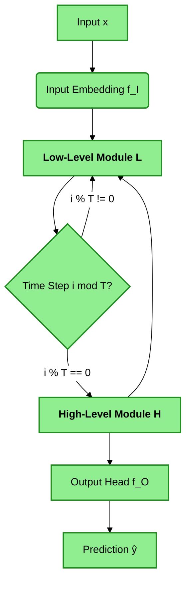

```mermaid
%%{init: {'theme':'base', 'themeVariables': { 'primaryColor': '#ffffff', 'primaryTextColor': '#000000', 'primaryBorderColor': '#000000', 'lineColor': '#000000', 'secondaryColor': '#ffffff', 'tertiaryColor': '#ffffff', 'background': '#ffffff', 'mainBkg': '#ffffff', 'secondBkg': '#ffffff', 'tertiaryBkg': '#ffffff'}}}%%
graph TD
    A[Input x] --> B(Input Embedding f_I)
    B --> C[Low-Level Module L]
    C --> D{Time Step i mod T?}
    D -- i % T != 0 --> C
    D -- i % T == 0 --> E[High-Level Module H]
    E --> C
    E --> F[Output Head f_O]
    F --> G[Prediction ŷ]
    
    style C fill:#90EE90,stroke:#228B22,stroke-width:2px,color:#000000
    style E fill:#90EE90,stroke:#228B22,stroke-width:2px,color:#000000
    style A fill:#90EE90,stroke:#228B22,stroke-width:2px,color:#000000
    style B fill:#90EE90,stroke:#228B22,stroke-width:2px,color:#000000
    style D fill:#90EE90,stroke:#228B22,stroke-width:2px,color:#000000
    style F fill:#90EE90,stroke:#228B22,stroke-width:2px,color:#000000
    style G fill:#90EE90,stroke:#228B22,stroke-width:2px,color:#000000
    
    classDef module font-weight:bold,color:#000000;
    class C,E module
    
    click C "HRM_L_Details" "Low-Level: Fast, detailed reasoning"
    click E "HRM_H_Details" "High-Level: Slow, abstract planning"
```