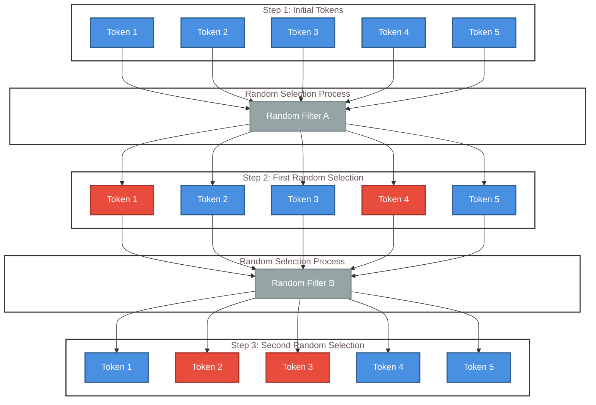

```mermaid
%%{init: {'theme':'base', 'themeVariables': {'primaryColor': '#4A90E2', 'primaryTextColor': '#ffffff', 'primaryBorderColor': '#2E5C8A', 'lineColor': '#333333', 'secondaryColor': '#E74C3C', 'tertiaryColor': '#95A5A6', 'background': '#ffffff', 'mainBkg': '#ffffff', 'secondBkg': '#ffffff', 'tertiaryBkg': '#ffffff'}}}%%
graph TD
    subgraph S1 ["Step 1: Initial Tokens"]
        T1[Token 1]
        T2[Token 2]
        T3[Token 3]
        T4[Token 4]
        T5[Token 5]
    end
    
    subgraph Filter1 ["Random Selection Process"]
        F1[Random Filter A]
    end
    
    subgraph S2 ["Step 2: First Random Selection"]
        T6[Token 1]
        T7[Token 2] 
        T8[Token 3]
        T9[Token 4]
        T10[Token 5]
    end
    
    subgraph Filter2 ["Random Selection Process"]
        F2[Random Filter B]
    end
    
    subgraph S3 ["Step 3: Second Random Selection"]
        T11[Token 1]
        T12[Token 2]
        T13[Token 3]
        T14[Token 4]
        T15[Token 5]
    end
    
    %% Consecutive connections
    T1 --> F1
    T2 --> F1
    T3 --> F1
    T4 --> F1
    T5 --> F1
    
    F1 --> T6
    F1 --> T7
    F1 --> T8
    F1 --> T9
    F1 --> T10
    
    T6 --> F2
    T7 --> F2
    T8 --> F2
    T9 --> F2
    T10 --> F2
    
    F2 --> T11
    F2 --> T12
    F2 --> T13
    F2 --> T14
    F2 --> T15
    
    %% Styling for subgraphs
    style S1 fill:#ffffff,stroke:#333,stroke-width:2px
    style S2 fill:#ffffff,stroke:#333,stroke-width:2px
    style S3 fill:#ffffff,stroke:#333,stroke-width:2px
    style Filter1 fill:#ffffff,stroke:#333,stroke-width:2px
    style Filter2 fill:#ffffff,stroke:#333,stroke-width:2px
    
    %% Step 1: All tokens active (blue)
    style T1 fill:#4A90E2,stroke:#2E5C8A,stroke-width:2px,color:#fff
    style T2 fill:#4A90E2,stroke:#2E5C8A,stroke-width:2px,color:#fff
    style T3 fill:#4A90E2,stroke:#2E5C8A,stroke-width:2px,color:#fff
    style T4 fill:#4A90E2,stroke:#2E5C8A,stroke-width:2px,color:#fff
    style T5 fill:#4A90E2,stroke:#2E5C8A,stroke-width:2px,color:#fff
    
    %% Step 2: Random elimination (Tokens 1 and 4 eliminated)
    style T6 fill:#E74C3C,stroke:#A93226,stroke-width:2px,color:#fff
    style T7 fill:#4A90E2,stroke:#2E5C8A,stroke-width:2px,color:#fff
    style T8 fill:#4A90E2,stroke:#2E5C8A,stroke-width:2px,color:#fff
    style T9 fill:#E74C3C,stroke:#A93226,stroke-width:2px,color:#fff
    style T10 fill:#4A90E2,stroke:#2E5C8A,stroke-width:2px,color:#fff
    
    %% Step 3: Tokens 1 and 4 back, but 2 and 3 eliminated
    style T11 fill:#4A90E2,stroke:#2E5C8A,stroke-width:2px,color:#fff
    style T12 fill:#E74C3C,stroke:#A93226,stroke-width:2px,color:#fff
    style T13 fill:#E74C3C,stroke:#A93226,stroke-width:2px,color:#fff
    style T14 fill:#4A90E2,stroke:#2E5C8A,stroke-width:2px,color:#fff
    style T15 fill:#4A90E2,stroke:#2E5C8A,stroke-width:2px,color:#fff
    
    %% Gray filter boxes
    style F1 fill:#95A5A6,stroke:#7F8C8D,stroke-width:2px,color:#fff
    style F2 fill:#95A5A6,stroke:#7F8C8D,stroke-width:2px,color:#fff
```